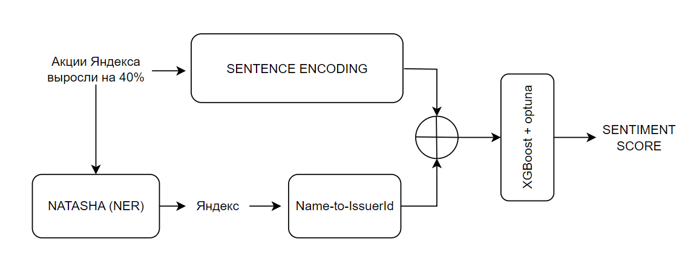

# iMESA - Investment Messages Entity-based Sentiment Analyzer

## Решение команды: **Удивительный Цифровой МИСИС**


### ✍️ Описание решения

Наше решение является быстрым и эффективным пайплайном скоринговой системы, которая позволит пользователям оценивать восприятие физических лиц акций на Россифском Фондовом Рынке на основе анализа сообщений и новостей из профильных telegram-каналов.



Скоринговая система состоит из нескольких компонентов:

**NER Extractor**
Сделан на основе библиотеки **NATASHA** для решения базовых задач обработки естественного русского языка. В нашем решении она используется для извлечения названий компаний из сообщений.

**Sentence Encoder**
Модель получает на вход текст предложения, а на выходе отдаёт многомерный вектор (768-мерный), примерно описывающий смысл этого предложения. Опираясь на [лидерборд русскоязычных энкодеров](https://github.com/avidale/encodechka/tree/master) мы выбрали **sentence-transformers/paraphrase-multilingual-mpnet-base-v2** для сохранения баланса между скоростью исполнения модели и качеством эмбеддингов.

**Sentiment Analyzer**
Получив на вход сообщение мы получаем его векторное представление с помощью **Sentence Encoder**, после извлекаем из текста компании с помощью **NER Extractor** и также получаем их представления и прибавляем к каждому из них эмбеддинг сообщения. Далее отправляем каждый из них в **XGBoost** и получаем финальные sentiment scores для каждой компании.

### ⛏️ Майним данные
В настоящее время LLM не являются лидерами в решении задач NER и Sentiment analysis (https://paperswithcode.com/task/named-entity-recognition-ner), но их можно использовать для быстрой разметки данных под эти задачи со специфическими отраслевыми инструкциями, объединив это преимущество с выданными авторами инструкциями по разметке датасета мы смогли подобрать промпт и **доразметить 20000 дополнительных триплетов** (corpus, entity, sentiment_score) за 20 минут используя фреймворк [vllm](https://github.com/vllm-project/vllm).

Ознакомиться подробнее с техническими решениями можно в [ноутбуке](./notebooks_important/technology.ipynb)

### 🏭 Запускаем решение

Скачать репозиторий:
```
git clone https://github.com/sostema/hakaton-gagarin-sentiment.git
```

Установить зависимости:
```
pip isntall -r requirements.txt
```

Запустить решение:
```
python run_me.py
```
